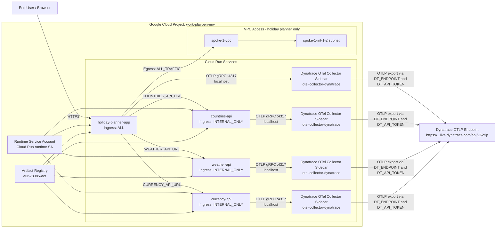

# GCP Compute Cloud Run Network Diagram

This diagram is based on Terraform resources in this folder and focuses on Cloud Run traffic flow, OpenTelemetry sidecars, and Dynatrace export.

## Notes

- `holiday-planner-app` is internet-facing (`INGRESS_TRAFFIC_ALL`).
- The API services (`countries-api`, `weather-api`, `currency-api`) are internal-only (`INGRESS_TRAFFIC_INTERNAL_ONLY`).
- Each Cloud Run service has two containers: app container + Dynatrace OTel collector sidecar.
- Telemetry path is app container -> localhost:4317 sidecar -> Dynatrace OTLP endpoint.
- Only `holiday-planner-app` currently has explicit VPC egress configured (`ALL_TRAFFIC`) into `spoke-1-vpc` / `spoke-1-int-1-2` subnet.
